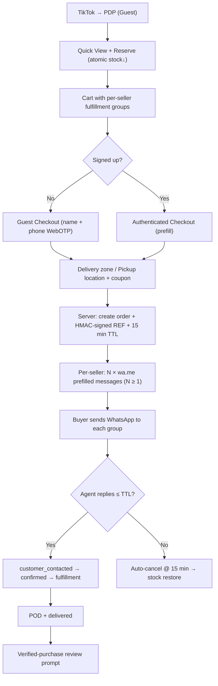
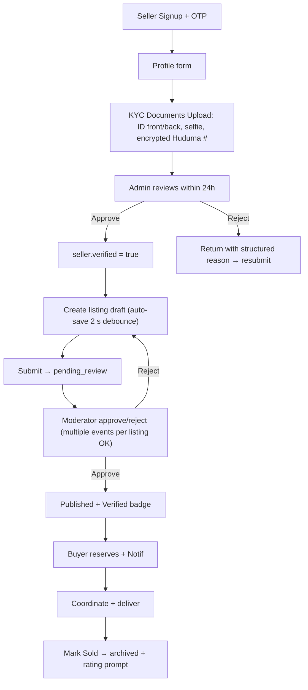

# Kenya Electronics Marketplace – Product Requirements Document (PRD)
**Revision 2 — Production-Quality Specification**

## 1. Product Overview

Kenya's premier electronics marketplace combining three systems: a premium managed store (new products), a verified-seller marketplace (used listings with moderation), and an intelligent product discovery engine. Designed exclusively for the Kenyan market with TikTok-driven Android traffic as the primary audience. The platform prioritises mobile-one-handed usability, trust, speed, and a WhatsApp-first reservation/order-confirmation flow without upfront online payments.

- **Purpose**: Become Kenya's most trusted electronics destination via a premium, fast, mobile-first experience with verified sellers, moderated listings, Nairobi same-day delivery, and nationwide town pickup.
- **Target Users**: Primary — Android mobile users arriving via TikTok (Guests, Buyers, Sellers); Secondary — Desktop shoppers, Moderators, and Super/Administrators.
- **Market Value**: Replace fragmented, low-trust Facebook/Telegram/Jiji-style listings with a unified, moderated, mobile-optimised platform that integrates with Kenyan buyers' and sellers' existing WhatsApp behaviour.
- **North-Star Metric (Phase 1)**: *Median checkout taps ≤ 5 from PDP view → WhatsApp message open on Android*, with 7-day seller listing → first-sale conversion ≥ 15%.

---

## 2. Core Features

### 2.1 User Roles & Permissions Matrix

| Role | Authentication | Core Permissions |
|------|---------------|------------------|
| **Guest** (Supabase `anon`) | None | Browse published products/listings, search, autocomplete, compare, deep-link from TikTok, add to cart via anonymous session cookie, guest checkout. **Cannot** write reviews, reserve items permanently, or access account. |
| **Buyer** | Email *or* Phone + Password; optional phone OTP verify | All guest + reserve (authenticated lifetime priority), create linked orders, wishlist, write verified-purchase reviews, receive notifications, price/stock alerts, saved delivery zones. |
| **Seller** | Phone verified *mandatory* + **KYC document verification** (see §2.2 Seller KYC) + optional manual profile review | All buyer + upload used listings, manage listings (edit/relist/sold), mark sold, **receive auto-split order_fulfillment_groups**, view listing enquiries, access seller dashboard (sales, views, rating). |
| **Moderator** | Admin-invited authenticated user, role claim in JWT | Browse moderation queue, approve/reject listings with reason, edit listing content (non-price), view listing reports, assign reports, suspend sellers (temporary). Cannot configure system or delete users. |
| **Administrator** | Super-Admin-invited, 2FA mandatory at login | All moderator + CRUD products/categories/brands/warranties/spec-templates, homepage sections & banners & coupons, manage seller verifications, manage users (reset/suspend), view analytics, inventory alerts, delivery zones, pickup locations, reports export CSV. |
| **Super Administrator** | Seeded only at bootstrap via env var, 2FA mandatory | Full system access; assign/revoke Admin; audit logs, billing, payment/M-Pesa provider configs, system-settings reserved keys, **impersonate seller/buyer** (for support, logged in audit_logs). |

### 2.2 Feature Modules (v1 Launch Set)

1. **Landing Page**: Asymmetric editorial hero, category shortcut grid, quick-view featured carousel, trending deals (with price-drop alert CTA), used marketplace spotlight (verified-badge sellers), trust strip, newsletter, app-install smart banner.
2. **Search & Discovery**: Autocomplete (products / brands / categories / recent / popular), typo-tolerant FTS + trigram, Sheng/Swahili synonym dict, dynamic category filters, price slider, result sort, cross-category comparison max 4 with difference highlighting, dynamic OG image per product for TikTok share.
3. **Dynamic Categories System**: Unlimited levels with `parent_id` tree, per-category spec templates that drive: PDP spec matrix, filter sidebar, and product comparison rendering. Category landing pages with SEO metadata + breadcrumbs.
4. **Product Detail Page (PDP)**: Media gallery (images + optional video, 360° support future), Quick View modal on card hover/click, price (KES + compare-at + price-history badge), warranty, variants picker (storage/color/RAM), stock/inventory, seller card (for used), reviews (aggregate + verified-only), add-to-cart, **Reserve** with timer, WhatsApp share, compare toggle, related + "Customers who viewed this also bought X".
5. **Used Listings with Moderation**: Seller uploads 8 images + optional 120 s video, condition enum, negotiable flag, location, specs; listing enters `pending_review` → Moderator approve/reject with structured reason (rejection templates) → published (optional `verified_listing` badge). Edit/create cycles append to `moderation_queue` history (1 listing → N events).
6. **Seller Workflow with KYC**: Signup → Phone OTP (Safaricom/Airtel/Telkom) → Seller profile form → **Mandatory KYC**: upload National ID / Passport / Huduma card front/back + selfie-with-ID, enter Huduma number (encrypted) → Admin verification (status: pending/rejected/approved) → Seller `verified=true` → Unlimited listings (rate-limited 10/hour, 50/day). Listing drafts auto-save every 2 seconds with crash recovery.
7. **Cart, Reservations & Stock Integrity**: Anonymous session cart (UUID cookie) + authenticated merge-on-login. Add-to-reserve performs **atomic** stock decrement via `FOR UPDATE SKIP LOCKED`. Reservation TTL default 20 minutes (per `system_settings.reservation_ttl_minutes`, user-extendable once +10 min). **Per-minute cron sweeper** releases expired reservations **plus** on-demand expiry check at every catalog read to close race window. Oversell: impossible (SQL-level stock ≥ qty constraint).
8. **WhatsApp-First Checkout**: Guest checkout allowed (eliminates sign-up friction). User enters name + phone + optional email, selects Delivery by zone *or* Pickup Location. Clicks **Confirm & Send via WhatsApp** → Server Action creates `order (status='pending_whatsapp')` + `order_items` + **signed reference** (HMAC-SHA256 ref + 8 char sig) → Opens `wa.me/<BUSINESS_NO>?text=URL-ENCODED MSG` with items, totals, delivery choice, pickup zone, and `Ref #ELEC-XXXX-XXXX(SIG)`. Order **TTL 15 min**: if not `customer_contacted` within TTL, auto-cancelled with stock restore. **Split-fulfillment per seller**: cart with Platform + Seller A + Seller B generates 3 separate WhatsApp messages (1 per fulfillment_group) + 1 parent order reference.
9. **Delivery, Pickup & Fulfillment**: Nairobi 8 zones (CBD, Westlands, Kilimani, Kileleshwa, Eastleigh, Karen, Thika Rd, South B) with per-zone same-day fee + min/max ETA days. Outskirts Nairobi (1-day), rest of Kenya (2–5 day estimates via Sendy/GIGS partners). Pickup locations table (name, address, operating_hours, lat/lng, active). Fulfillment groups assigned to `order_fulfillments` with `partner_name`, `tracking_no`, `proof_of_delivery_photo_url`, `delivered_at`, `signature_url`.
10. **Admin Dashboard**: KPI grid (GMV, reservations, pending approvals, sellers onboarded, inventory alerts, listing reports). Recharts trend charts (sales/category/traffic-source). Filterable data tables: products (bulk publish/unpublish), moderation queue (1-click approve/reject templates), orders, sellers, listing reports, coupons. System settings (typed key-value + reserved columns). Homepage sections editor (hero, carousels, category blocks). Audit logs (with impersonation actor when applicable).
11. **Accounts, Notifications, Alerts**: Buyer dashboard, order history, wishlist, saved delivery addresses, notification preferences (toggle per channel per event type: in-app, SMS, WhatsApp, email). Reservation expiry, listing status transitions, order updates via Supabase Realtime. **Price-drop alerts** (user sets KES threshold per product) + **Back-in-stock alerts** per product variant (subscribe via phone/WhatsApp).
12. **Trust, Moderation & Safety**: Verified seller badge (KYC passed), verified listing badge (admin inspected), warranty badge, negotiable badge, 6-level condition indicators, listing report reasons (counterfeit/prohibited/misleading_price/wrong_category/stolen/scam/other) → moderator workflow. Reviews: **enforced verified purchase FK** to order_item_id → gate only if order delivered. Disputes mediation (buyer vs seller vs platform): raise → assign admin → resolve (refund/partial/close) → log in seller ledger.
13. **Observability, Reliability, Security**: Sentry (server + client), Logtail/Vercel Log Drain, Baselime APM, alert policies (5xx >1%, p95 latency >800ms, RLS violation >5/hour, stock anomaly). Supabase PITR enabled (7-day). Weekly encrypted offsite backup + 1h-RTO / 5m-RPO runbooks. All admin/moderator writes append audit_logs.
14. **Attribution & Growth**: UTM source/medium/campaign/content + TikTok click_id + referer_host captured in sessions, carts, orders tables. Affiliate code support (future). Share Product UX (WhatsApp/TikTok/Instagram/Copy Link) with UTM-propagated deeplinks + dynamic product OG image.

### 2.3 Page Details Matrix (v1)

| Page | Module | Feature description |
|------|--------|---------------------|
| Landing | Asymmetric Hero | Editorial headline (Sora), Kenyan copper gradient wash BG, featured product card with Quick View CTA, category shortcuts overlay, staggered reveal |
| Landing | Category shortcuts grid | 4-up (mobile 3-up) rounded tiles, coloured per category, product count pill. Tap → category landing |
| Landing | Featured carousel | Horizontal snap-scroll card row. Card: image, price badge, verified/warranty pill, Quick View icon bottom-right, Reserve FAB top-right |
| Landing | Trending deals + Alerts | Countdown stock badges. "Price drop alert" bell CTA (authenticated or guest phone modal). |
| Landing | Used Marketplace Spotlight | Filter chips (All / Nairobi / Phones / Laptops). Listing cards with Seller Verified badge ring |
| Landing | Trust strip | 4 cards: Verified Sellers (Jade), 1 Yr Warranty Options (Jade), Secure Reserve (Navy), Nairobi Same-Day (Copper) |
| Search | Autocomplete dropdown | 4 sections: Products (thumb+price), Brands, Categories, Recent Search chips. Arrow nav, typo "Did you mean: X" via trigram similarity ≥ 0.35 |
| Search | Results page | Mobile: sticky filter bottom sheet, result chips, 2-col grid, infinite scroll paginate. Desktop: 280px left filter sidebar + 5-col grid. Result count, sort (relevance/price-asc/price-desc/newest/popular) |
| Search | Dynamic filters | Collapsible accordion sections. Per-category dynamic spec filters only (no TV filters on phones). Dual-thumb price slider (KES), condition enum chip row, brand multi-select, Location county dropdown, Seller Verified toggle. Apply/Reset footer |
| Product Quick View Modal | Compact PDP | Popover (Radix Dialog) with image gallery strip, variant picker (color/RAM/storage dropdown), price + quick Reserve + Open PDP link. TikTok-first conversion shortcut |
| Product Detail | Media gallery | Swipeable main image, dot indicators, thumbnail strip, video play overlay badge with looping autoplay muted MP4, pinch-zoom future |
| Product Detail | Variants picker | product_variants rendered as radio chips (color swatches, storage pills) — stock per variant, price delta per variant |
| Product Detail | Spec matrix | Rounded card, grouped rows (Performance / Display / Battery / Camera / Connectivity), primary specs Copper highlighted, per-spec Compare toggle checkbox |
| Product Detail | CTA bar (sticky bottom mobile) | 1) Reserve Now (Copper gradient pill, price aligned left with timer chip when reserved), 2) Add to Cart (outline), 3) WhatsApp Share icon |
| Product Detail | Price & History | `KSh 24,999` with strikethrough compare-at. "Was KSh 29,999 · 17% OFF" badge derived from price_history 90-day window |
| Product Detail | Seller Card (used) | Avatar with verified ring, name, rating, response-time %, "View Seller Profile" + "Contact Seller (no reserve)" enquiry button. |
| Product Detail | Reviews | Verified Purchase only. 5-star aggregate, 1–5 filter tabs, write review gated by order_item FK. |
| Product Detail | Price Drop / Back in Stock | Buttons below CTA → triggers price_alerts / stock_alerts row → notifies via WhatsApp/SMS when condition fires |
| Compare | Bar (sticky) | Floating bottom bar as items added: "3 of 4 added". Clear All, Compare button. Max 4 validated. |
| Compare | Table view | Sticky first column (spec name), advantage cell green highlight, matching cell neutral, missing spec zinc. Mobile: stacked per-product cards with side-by-side slider. Cross-category: common specs top, per-category grouped sections below. |
| Category Landing | SEO hero | Category image banner, page heading, intro paragraph, subcategory breadcrumb pill row |
| Category Landing | Product grid + filters | Mirrors search layout with category context filter summary chips |
| Seller Profile | Header | Avatar with verified ring, display name, response hours, joined date, ratings bar, WhatsApp CTA, Location (Kilimani, Nairobi) |
| Seller Profile | Tabs + grid | Active Listings (default) / Sold / Reviews. Search within seller, sort, filter condition. |
| Become a Seller | KYC multi-step stepper | Phone verify → Profile → Documents (ID front/back, selfie, Huduma # encrypted field) → Agree TOS → Submit → Pending verification screen. |
| Seller New Listing | Multi-step stepper + auto-save | Category → Brand → Model (optional "My model isn't listed") → Condition → Price + negotiable → Description (AI assist future) → Upload up to 8 images + 1 video 120 s max → Location → Preview → Submit. JSONB listing_drafts auto-save every 2 s debounce, restore on crash/reload. |
| Moderation Queue | List + detail | Compact list with thumbnail/seller/age. 1-click Approve / Reject (template dropdown: "Poor photos","Misleading price","Prohibited","Stolen"). Detail side panel: images review, edit listing title/description inline. |
| Cart | Item list | Thumbnail + title + variant, per-item TTL countdown reservation chip, qty stepper, unit price, line total, remove. Cart merge banner if newly logged in (combined with anonymous). Empty state: Trending deals recommendations |
| Cart | Split by seller summary | "Platform items (KES X) · Seller A (KES Y) · Seller B (KES Z)" cards with per-seller sub-total + delivery fee preview |
| Checkout | Form (Guest + Buyer) | Name, Kenyan phone (auto format +254, WebOTP autofill), email (optional), Delivery/Pickup segmented control. Delivery: select zone dropdown with fee/ETA inline. Pickup: select pickup_location with hours + map marker. Coupon code input. Notes (500 char). |
| Checkout | Split summary | Per-seller group totals → Each group will send its own WhatsApp message. Single "Confirm & Open WhatsApp" CTA (Copper, full-width) |
| Order Confirmation (post-WhatsApp) | Status page | Order ref with signature (copy button), per-seller WhatsApp action buttons (re-send), order timeline, estimated delivery, share order link. Optional Create Account post-checkout (prefilled from order) |
| Wishlist | Grid | Item grid, quick Add to Cart / Reserve, quick Remove, Share Wishlist link. |
| Notifications | Feed | Realtime updates. Reservation about-to-expire pulse animations. Clear All, Mark All Read. Filter: All / Orders / Listings / Promotions. |
| Account | Settings subpages | Profile, Phone (re-verify), Password, Linked WhatsApp, Saved Addresses, Notification Preferences, Security (2FA toggle for sellers/admin), Data Export |
| Admin Dashboard | Overview KPIs | GMV 30d, Reservations (24h), Pending Approvals, Sellers Onboarded, Inventory Alerts (low-stock products), Listing Reports |
| Admin Dashboard | Charts (Recharts) | Sales trend line, category performance bars, traffic source pie, seller leaderboard top 10 |
| Admin Products | CRUD + bulk | Table: search, filter, bulk publish/unpublish, export CSV, duplicate product. New: variants table row add/remove (SKU auto-gen). |
| Admin Categories | Tree editor + spec templates | Drag-drop tree reorder. Spec template side drawer: add group (Performance) → add spec (key, label, type, unit, filterable, highlighted, sort, enum_options JSONB). SEO metadata inputs |
| Admin Analytics | Search analytics | Top searches, failed searches (zero results), CTR by query, synonym suggestions from failed search pairs. Export CSV. |
| Admin System | Settings | Typed sections: Reservation TTL (minutes), Default currency (KES), Business WhatsApp Number, Nairobi cutoff-time same-day, Site Name, SEO defaults. Delivery Zones editor, Pickup Locations editor, Coupons editor, Banners CRUD, Homepage Sections editor. |
| Admin Auditing | Audit log table | Filter by actor / target_type / action / date range. Columns: Impersonator (if any), Actor, Action, Target, before/after JSON diff preview, IP hash. |

---

## 3. Core Processes

### 3.1 Buyer Flow (Natural Language)
A mobile user lands from TikTok on a PDP (already hydrated server-rendered, instant reserve button visible). They tap Quick View → Reserve. On confirmation the stock is **atomically decremented** and a 20-min timer appears. They add a second used listing to cart → Cart now shows two per-seller groups: Platform + Seller A. Checkout: guest (no signup!) enters name, auto-formatted Safaricom number via WebOTP autofill, selects Kilimani delivery zone, applies a coupon — confirmed. Server creates one parent order with 2 fulfillment_groups, HMAC-signed reference, and sets TTL 15 min. WhatsApp opens with TWO prefilled wa.me tabs (one per fulfillment group) showing: reference, items, totals, zone, delivery ETA, buyer details, and a signature. Buyer sends each message. A customer agent marks order → `customer_contacted` within TTL → stock permanently decremented. Fulfillment is dispatched → proof of delivery photo → buyer reviews (only then, since order_item FK verified delivered).

### 3.2 Seller Flow (Natural Language)
Seller signs up → receives SMS OTP via Africa's Talking → auto WebOTP fills → name/bio filled → **KYC documents upload step** (ID front, ID back, selfie, Huduma # encrypted in Postgres). Status pending. Within 24h an Admin approves KYC → seller_verification_documents rows set approved, seller_profiles.verified=true, notification sent. Seller taps +Sell → multi-step form, listing_drafts auto-save every 2s → submit → moderation queue. Moderator: approves with note "Photos clear, price fair" → `listing.status=published` + moderation_queue row. Buyer reserves → seller is notified Realtime + WhatsApp template, order_fulfillment_group created. Seller confirms delivery, marks sold, rating prompt sent to buyer → seller.rating_avg recomputed via trigger.

### 3.3 Admin & Moderation Flow (Natural Language)
Admin daily: 1) Inventory alert banner → restock. 2) Moderation queue bulk approve/reject. 3) Listing reports resolved. 4) Failed searches reviewed → add brand/spec synonyms or add missing listing to catalogue. 5) Seller verifications approve/reject KYC (with rejection templates). 6) Analytics: UTM campaign ROI, TikTok click_id → purchase conversion. 7) Configure system: holiday delivery fee surcharge via system_settings, activate coupon, update hero banner.

### 3.4 Order Lifecycle FSM (Immutable order_events append-only log)
```
pending_whatsapp --(seller_customer_contacted_within_ttl | manual)--> customer_contacted
pending_whatsapp --(ttl 15 min sweeper | guest_abandon)--> cancelled (stock_restore + reservation release)
customer_contacted --(confirmed_payment_or_mou)--> confirmed
confirmed --(packed)--> processing
processing --(driver assigned)--> out_for_delivery OR ready_for_pickup
out_for_delivery --(photo_of_delivery + signature)--> delivered
ready_for_pickup --(buyer picks up + signs)--> delivered
delivered --(refund requested 7 day window / dispute wins)--> refunded (partial/full, seller_ledger entry)
any_state --(fraud detected by super_admin)--> cancelled (forced, audit logged, reason)
```

### 3.5 Buyer Flow Mermaid (v2, with split-fulfillment + HMAC ref)



### 3.6 Seller Identity KYC + Listing FSM Mermaid



---

## 4. User Interface Design

### 4.1 Design System — Revised Tokens

- **Aesthetic Direction**: **Refined Kenyan Premium Minimalism** (Editorial). Kenyan Navy + warm Copper accents + Jade success. Kenyan-coast gradient wash hero backgrounds; subtle copper dust noise texture on hero/CTAs.
- **Primary**: `brand-navy` #0B2545 (14.8:1 contrast on white; accessible)
- **Primary-600**: #0A1E39 (CTA gradient end)
- **Accent Copper**: `brand-copper` #C4651A (text only on 18px+, or as bg with white text — contrast 3.9:1 meets AA-large; never for body text on white directly)
- **Accent Jade**: `brand-jade` #0E7C7B (verified badges, success, in-stock)
- **Neutrals**: Zinc (#FAFAFA/#F4F4F5/#E4E4E7/#A1A1AA/#71717A/#52525B/#27272A/#18181B)
- **Semantic**: Error #B91C1C, Warning #D97706
- **Buttons**: Rounded-xl (16px). Primary: gradient `brand-navy → primary-600` + copper 1px inner glow ring, hover lift translateY(-1px) shadow-lg. Secondary: 2px border `brand-copper` with bg-transparent → hover filled copper/white. Tertiary: pill zinc hover:bg-zinc-200.
- **Typography**:
  - Display Sora: hero, h1, h2, h3, KPI numbers, price
  - Body Work Sans: 14/20 body, 16/24 body-lg, 18/28 subtitle
  - Mono JetBrains Mono: prices KSh, refs, SKUs
- **Card surface**: rounded-2xl, zinc-50 background, soft shadow `0 2px 6px -2px rgba(11,37,69,.08)`, hover → `shadow-lg` + 0.3 copper border glow.
- **Iconography**: Lucide stroke 1.5, default 20px, Copper for active CTAs, Jade for verified ticks.
- **Motion**:
  - Hero staggered: 100 ms increments for content blocks
  - Card: hover translate-y(-1) 200 ms cubic-bezier(.2,.8,.2,1)
  - Reservation timer: pulse red when <1 min + 1 s tick (subtle numeric flip)
  - Toast: slide-up 250 ms from bottom mobile, top-right desktop
  - Page transitions: Next.js view-transition fade + slide 8px upward

### 4.2 Page Design Overview — Updated with Fixes

| Page | Module | UI Elements |
|------|--------|-------------|
| Landing | Hero | Asymmetric: Sora 44/52 mobile 56/64 desktop heading "Own it. Trust it. Delivered today." Copper CTA pill "Browse Smartphones →". Featured product Quick View card on right with copper ring stroke, diagonal 2-degree accent line, navy→copper gradient mesh bg |
| Landing | Quick View Modal | Radix Dialog rounded-2xl, 2-column desktop, stacked mobile. Close icon top-right. Gallery left. Variants + price + Reserve/Add right. |
| Landing | Category grid | 4 col / mobile 3 col. Each tile bg-tinted per category (Phones navy, Audio copper gradient). Icon 24. Product count zinc chip top-right |
| Landing | Price-Alert Badge on deals cards | Small copper bell CTA with "Notify me when < KES 22,000" modal with phone input |
| Search | Autocomplete | Dropdown rounded-2xl, copper ring on focus. Sections with headers. "Did you mean: XXXX" row highlighted when trigram match |
| Search | Filter Bottom Sheet (mobile) | Radix Sheet slide-up. Accordion groups. Copper dual-thumb range slider. Apply/reset sticky copper footer full-width |
| PDP | Variants row | Radio group with copper ring selection. Out-of-stock variant greyed + click triggers back-in-stock alert modal |
| PDP | Split CTA sticky bar mobile | Two buttons: Left price + Reserve (copper gradient pill w/ countdown chip when reserved). Right outline Add-to-cart. WhatsApp share icon in gutter |
| PDP | Seller Contact Enquiry | Outline pill + Lucide Message-circle "Contact Seller Without Reserving" opens modal with prefilled WhatsApp message → enquiry row created |
| Compare | Bottom bar | Fixed, elevated, 4 slots. Copper "Compare (3)" button. Shows thumbnail chips with X remove |
| Checkout | Summary bottom sheet mobile | Per-seller breakdown. Reference preview. One prominent copper "Confirm & Send via WhatsApp" full-width |
| Seller KYC | Document upload steps | Drop-zone with drag + camera capture option. Live preview thumbnails, Huduma number masked entry (●●●●●●●●●●123) — encrypted at DB |
| Seller Listing | Stepper progress | Linear copper bar top + numbered circles, filled copper for done |
| Cart | Reservation timer line-item | Chip right-aligned per row: Jade if >5 min, Amber if 1–5 min, Red pulse if <60s |
| Admin | Audit impersonation row | If impersonation_actor_id present: show two avatars "SuperAdmin Alice → as Seller John" with distinct pill |
| Admin | KPIs | 4 col desktop / 2 col mobile. Copper border top for GMV, navy for reservations, jade for approvals, zinc for sellers |

### 4.3 Responsiveness — Refined for One-Handed Use
- Breakpoints sm/md/lg/xl/2xl unchanged from v1.
- **Thumb zone**: Mobile bottom nav 72 px height with active Copper text/icon. Sell FAB centered elevated Copper pill +8 px above bar (thumb-reachable).
- **Search sticky**: 56 px mobile header with search input always reachable.
- **No horizontal scroll**: Tested at 320×568 (iPhone SE) — every card, filter, PDP scrolls vertically only.
- **Admin**: Desktop collapsible 260 px sidebar (Lucide icons + labels). Mobile bottom nav same as store but with Admin/Moderator label color.

### 4.4 PWA / Installability (v2, library chosen)
- **PWA engine**: **@serwist/next** (maintained Next-PWA successor; App Router/RSC streaming compatible) with inject manifest, offline fallback, cache strategies.
- **Install prompt**: Smart in-page banner bottom after 3 visits with dismiss + later options — do NOT block user flow.
- **Manifest share_target**: `action: /seller/listings/from-share`, method: GET, params: photos (images[]) → seller "List from gallery" shortcut.
- **Manifest url_handlers**: Register `electronics.co.ke, *.electronics.co.ke` so TikTok deeplinks open PWA when installed.
- **Offline state**: Cached skeleton product grid + "You're offline · Cached items only" copper banner; search only works with local history.

### 4.5 Accessibility — AA+ Baseline
- Color AA copper used only for ≥18px text or background combos; body text always navy-900/zinc-800 on white/zinc-50.
- `focus-visible:ring-2 focus-visible:ring-[#C4651A]` global. Skip link top: `<a className="sr-only focus:not-sr-only focus:fixed focus:top-4 focus:left-4 ..." href="#main">Skip to content</a>`
- `aria-live="polite"` on toast root + reservation countdown root.
- Radix Dialog/Sheet/Select/Accordion/Tabs baked for keyboard + SR.
- Table scope="col" + caption; comparison sticky headers.
- WCAG target 44×44 px minimum tap area for every primary interactive control.
- Text-resize test: 200% zoom without layout break on all pages.
