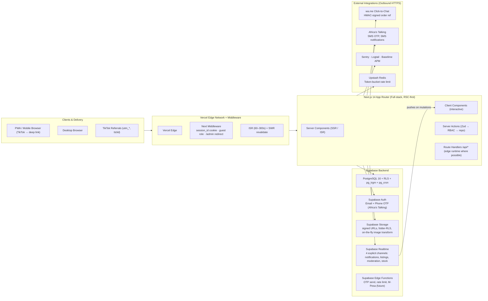
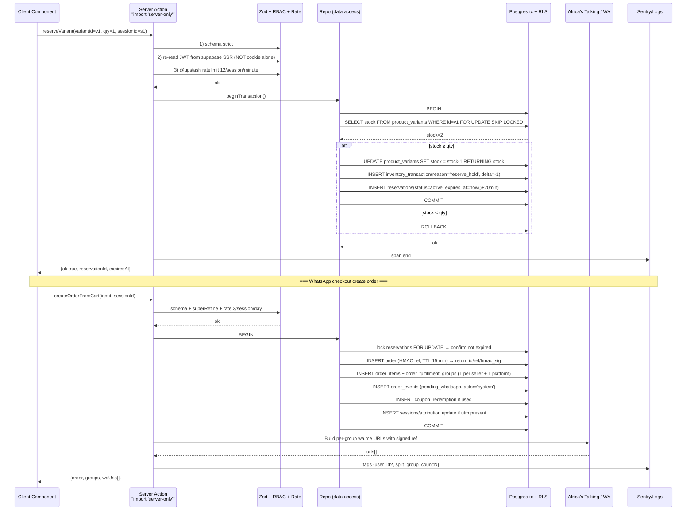

# Kenya Electronics Marketplace – Technical Architecture Document
**Revision 2 — Production-Quality Specification (59 fixes applied)**

## 1. Architecture Design

### 1.1 System Context & Data Flow



### 1.2 High-Level Design Principles (Revised)
1. **Security-First**: Every mutation flows through a Server Action that (a) imports `'server-only'` or admin barrel, (b) validates with Zod strict, (c) re-verifies JWT claims via Supabase SSR client (never trusts middleware cookie alone), (d) appends audit_logs, (e) rate-limited via Upstash token bucket.
2. **Stock Integrity**: Stock decrement uses `BEGIN; SELECT … FOR UPDATE SKIP LOCKED;` in a CTE + CHECK(stock ≥ qty). Reservation cron (1 min) + on-demand expiry check *at every read* close race windows.
3. **Trust & KYC**: Seller cannot publish listings until `seller_verification_documents.status = 'approved'`. Huduma number encrypted with `pgcrypto pgp_sym_encrypt(key: env $KYC_ENCRYPTION_KEY)`.
4. **RSC + ISR Everywhere**: Pages RSC except explicitly interactive "use client". Critical routes ISR: landing 60 s, categories 300 s, products 60 s — regenerate on mutation with `revalidateTag()`.
5. **Search Performance**: Separate `mv_search_index` materialized view (GIN on tsvector + gin_trgm), refreshed CONCURRENTLY every 15 min; `pg_trgm.similarity_threshold = 0.35`; Sheng/Swahili stoplist + synonym dict.
6. **Observability Mandatory**: Sentry.init (server + client), Logtail drain, Baselime traces; alerts on 5xx>1%, p95>800 ms, RLS violations>5/hour, reservation anomaly ratio>10%.
7. **PITR + Backups**: Supabase PITR 7-day enabled; weekly encrypted offsite backup; documented 1-hour RTO / 5-minute RPO runbook.

---

## 2. Technology Description (Updated)

| Layer | Library | Purpose & Decisions |
|-------|---------|---------------------|
| Framework | **Next.js 14.2 (App Router)** | RSC streaming, Server Actions, Route Handlers, `generateMetadata`, view transitions, Edge runtime opt-in |
| Language | **TypeScript 5.4** | strict + noUncheckedIndexedAccess + exactOptionalPropertyTypes. Shared types in `src/types/*` with Supabase DB-generated types + manual domain overlays. |
| UI Runtime | **React 18.3** | useOptimistic for checkout/reserve, useTransition for route search-param filters, Suspense boundaries skeleton grids 8–12 |
| Styling | **Tailwind CSS 3.4 + CSS variables** | `tailwind.config.ts` tokens + `@theme` CSS-in-CSS layer. Copper/navy/jade brand palettes; `prefers-reduced-motion` honored. |
| Icons | **lucide-react 0.400+** | 1.5 px stroke, 20 px default, tree-shaken |
| Client state | **zustand 4.5** | compare list max 4, mobile-ui drawer state, search-form filters (local optimistic) |
| Forms | **react-hook-form 7 + zod 3 + @hookform/resolvers** | Strict schemas; `.superRefine` cross-field (e.g. delivery_zone_id required iff mode='delivery') |
| Supabase SDK | **@supabase/ssr** (server) + **@supabase/supabase-js 2** (client) | Middleware `createServerClient`, Server Actions `createServerClient`, Client Components `createBrowserClient` for Realtime |
| Charts | **recharts 2 (tree-shaken imports)** | Admin trends only; import from `recharts/Line` etc. not root to reduce bundle |
| Images | **next/image** + Supabase Storage on-the-fly transforms | Remote patterns `*.supabase.co`; AVIF first; sizes per breakpoint; quality=70 mobile/75 desktop; prefetch hero image with `fetchpriority="high"` |
| Search Phase 1 | **Postgres + mv_search_index (GIN: tsvector + gin_trgm_ops)** + Sheng synonym dict | Autocomplete endpoint edge runtime; 200 ms p95 target; semantic search pgvector future path |
| DB Migrations | **Supabase CLI, migrations/*.sql, up-only** | Use `supabase db push`; migrations include seed reference data (roles, permissions, categories, brands, zones) |
| Scheduling | **pg_cron** (reservation sweeper 1 min, order sweeper 2 min, search MV refresh 15 min, counter denormalization triggers) | Do NOT use Supabase client cron for transactional flows; use db-level |
| Deployment | **Vercel** | `vercel.json`: image domains, rewrites, edge hints |
| PWA | **@serwist/next** (maintained next-pwa successor) | App Router streaming compatible; manifest via `app/manifest.webmanifest` metadata route; `injectManifest`; offline fallback skeleton |
| SEO/Metadata | **Next.js Metadata API** + custom JSON-LD builders in `src/lib/seo` | Product, BreadcrumbList, Organization, ItemList, Review, FAQPage schema |
| Rate Limiting | **@upstash/ratelimit + @upstash/redis** | Per-IP: search (60/min), listing (10/hour 50/day). Per-phone: OTP (3/5 min, 10/day). Per-user_id: report_listing (5/day) |
| Accessibility Primitives | **Radix UI** (Dialog, Sheet, Accordion, Select, RadioGroup, Tabs, DropdownMenu) | Controlled components; consistent keyboard nav; labelledBy everywhere |
| Linting/Formatting | **ESLint (next/core-web-vitals), Prettier, typescript-strict** | Pre-commit optional Husky; mandatory Vercel build typecheck + lint |
| Observability | **@sentry/nextjs, @logtail/next, @baselime/nextjs** | Custom spans for reserve() and create_order() server actions; 5xx alert webhooks to Ops Slack |
| Testing (Optional but Recommended) | **Vitest (unit) + Playwright (e2e)** | Cover: stock atomicity (parallel unit with promise.allSettled), checkout HMAC ref sign/verify, moderation RLS policy, admin impersonation audit_log. Run Playwright on Vercel preview deploy block-merge. |
| Image Transforms | **Supabase Storage render API** | `?width=400&quality=70&format=avif` appended to signed URLs for next/image loader custom |

---

## 3. Route Definitions (App Router, Updated) + Security Contract

| Route | Purpose | Rendering | Auth / RBAC Contract |
|-------|---------|-----------|------------------------|
| `/(store)/page.tsx` | Landing | RSC + ISR 60s | Public |
| `/(store)/search/page.tsx` | Search results | RSC; queryParams state | Public |
| `/(store)/search/suggestions/route.ts` | Autocomplete JSON | Edge runtime | Public, rate-limited |
| `/(store)/c/[categorySlug]/(page, products, sitemap)` | Category landing | RSC + ISR 300s | Public |
| `/(store)/p/[slug]-[id]/page.tsx` | PDP new | RSC + ISR 60s, revalidateTag on product update | Public |
| `/(store)/u/[slug]/page.tsx` | Used listing | RSC + SWR; Realtime stock/status | Public |
| `/(store)/seller/[sellerId]/page.tsx` | Seller profile + active listings | RSC + SWR | Public |
| `/(store)/compare/page.tsx` | Product compare, max 4, cross-category sectioning | Client + search params; server re-read on submit | Public |
| `/(store)/cart/page.tsx` | Cart view + per-item TTL chips | RSC (cart by session_id cookie) + client interactions | Public (anon session cookie), linked on login |
| `/(store)/checkout/page.tsx` | Checkout form + summary | RSC + client form | **Public Guest Allowed** (no signup required); JWT optional linked order later |
| `/(store)/orders/[ref]/page.tsx` | Order confirmation + timeline + resend WhatsApp | RSC. Access: signed ref_sig query param OR user_id=owner | Semi-public HMAC gated |
| `/(store)/sitemap.ts` + `/(store)/products/sitemap/[page]/route.ts` | Paginated sitemap products 50k/page | Metadata route + edge handler | Public |
| `/(store)/robots.ts` | robots.txt disallow /admin /account /api /checkout | Metadata route | Public |
| `/(store)/og/p/[id]/route.ts` | Dynamic OG image per product (Vercel OG @vercel/og) | Edge runtime PNG | Public |
| `/(auth)/login/page.tsx`, `register`, `verify`, `reset` | Auth flows | Client form + server action | Public; OTP rate limited |
| `/(account)/account/page.tsx` | Buyer dashboard | RSC | Require authenticated JWT (verified SSR) |
| `/(account)/account/orders, wishlist, notifications` | Account sections | RSC + Realtime | Require authenticated |
| `/(account)/seller/apply/page.tsx` | KYC onboarding multi-step | Client form + listing_drafts auto-save | Auth; phone verified required |
| `/(account)/seller/dashboard, listings, listings/new, listings/[id]/edit` | Seller operations | RSC + Server Actions | Require authenticated **AND** `seller_verification_documents.status = approved` |
| `/(admin)/admin/*` (12 routes) | Overview, Products, Categories, Brands, Sellers, Moderation, Orders, Analytics, System, Audit, Coupons, Homepage Sections | RSC + Server Actions + client tables | Require authenticated **AND** JWT `app_metadata.role ∈ {moderator,admin,super_admin}`; specific routes gated in action by permission key |
| `/api/search/autocomplete/route.ts` | JSON: 5 products + 3 brands + 3 categories | **Edge runtime** + Upstash 60/min/IP | Public |
| `/api/search/route.ts` | GET full search (filters, sort, page) | Node route; revalidate 10 s | Public |
| `/api/analytics/route.ts` | POST ingest `{event_name, properties}` anonymised; no PII in logs | Edge route, Upstash 500/session | Public CORS locked to site origin |
| `/api/whatsapp/[orderRef]/route.ts` | GET returns signed wa.me URL for a ref | JWT or HMAC sig gate | Protected |
| `/api/reviews/route.ts` | POST review | Server-verified order_item.delivered FK check | Auth required |
| `/api/reports/route.ts` | POST listing report (reason enum + details) | Auth, rate 5/day/user | Auth required |
| `/api/alerts/price,/stock/route.ts` | POST subscribe/unsubscribe; outbound AT/WA on match | Auth + guest phone | Auth or verified phone |
| `app/manifest.webmanifest` | PWA manifest with share_target + url_handlers | Metadata route | Public |

---

## 4. Data Contract Definitions (TypeScript + Zod, v2 with new entities)

### 4.1 Shared Types (`src/types/index.ts`)
```ts
export type Role = 'guest' | 'buyer' | 'seller' | 'moderator' | 'admin' | 'super_admin';
export type PermissionKey =
  | 'products.manage'
  | 'categories.manage'
  | 'moderate.listings'
  | 'moderate.reports'
  | 'sellers.verify'
  | 'users.manage'
  | 'analytics.view'
  | 'system.configure'
  | 'finance.ledger'
  | 'audit.view'
  | 'impersonate.use';

export interface Attribution {
  utm_source?: string;
  utm_medium?: string;
  utm_campaign?: string;
  utm_content?: string;
  ttclid?: string; // TikTok click_id
  referer_host?: string;
  affiliate_code?: string;
}

export interface Session {
  anonymous_id: string; // UUID cookie, 2 yr TTL
  user_id?: string;
  attribution: Attribution | null;
  first_seen_at: string;
  last_seen_at: string;
  country_code?: string;
  device?: string;
}

export interface ProductVariant {
  id: string;
  product_id: string;
  sku: string;       // UNIQUE db
  attributes_jsonb: { color?: string; storage_gb?: number; ram_gb?: number; size_in?: number; ... };
  price_delta_kes: number; // added to product base price
  stock: number;
  image_ids?: string[];
  barcode?: string;
}

export interface InventoryTransaction {
  id: string;
  variant_id?: string;
  listing_id?: string;
  reason: 'purchase' | 'reserve_hold' | 'reserve_release' | 'restock' | 'damaged' | 'shrinkage' | 'returned' | 'sold' | 'audit_adjust';
  qty_delta: number;
  actor_id?: string; // user id OR 'system'
  reservation_id?: string;
  order_id?: string;
  occurred_at: string;
  note?: string;
}

export interface ListingDraft {
  id: string;
  seller_id: string;
  listing_id?: string; // if editing existing
  step: number;
  content: unknown; // JSONB arbitrary step state
  updated_at: string;
}

export interface SellerVerificationDocument {
  id: string;
  seller_id: string;
  document_type: 'national_id' | 'passport' | 'huduma_card';
  document_number_enc: string; // pgp_sym_encrypt at DB layer
  front_image_url: string;
  back_image_url?: string;
  selfie_with_id_url: string;
  liveness_score?: number; // future
  submitted_at: string;
  reviewed_by_id?: string;
  reviewed_at?: string;
  status: 'pending' | 'approved' | 'rejected';
  rejection_reason?: string;
}

export type CouponDiscountType = 'percent' | 'fixed_kes';
export type CouponScopeType = 'global' | 'category' | 'product' | 'seller';
export interface Coupon {
  id: string;
  code: string;       // UNIQUE case-insensitive
  display_name: string;
  discount_type: CouponDiscountType;
  discount_value: number;
  min_cart_kes?: number;
  max_discount_kes?: number;
  max_uses_total?: number;
  uses_per_user?: number;
  scope_type: CouponScopeType;
  scope_ids: string[];
  stackable: boolean;
  starts_at: string;
  expires_at?: string;
  active: boolean;
}

export interface CouponRedemption {
  id: string;
  coupon_id: string;
  user_id?: string;
  order_id: string;
  discount_applied_kes: number;
  redeemed_at: string;
}

export type FulfillmentOwner = 'platform' | 'seller';
export interface OrderFulfillmentGroup {
  id: string;
  order_id: string;
  owner_type: FulfillmentOwner;
  owner_id?: string; // seller_id or null for platform
  whatsapp_target: string;
  sub_total_kes: number;
  delivery_fee_kes: number;
  status: OrderStatus; // per-group status
  tracking_summary?: string;
}
export interface OrderFulfillment {
  id: string;
  group_id: string;
  partner_name?: string; // 'Sendy', 'GIGS', 'In-House', 'Ridarr'
  tracking_no?: string;
  driver_name?: string;
  driver_phone?: string;
  status: 'assigned' | 'picked_up' | 'in_transit' | 'out_for_delivery' | 'delivered' | 'failed_attempt' | 'returned';
  proof_of_delivery_photo_url?: string;
  signature_url?: string;
  notes?: string;
  estimated_delivery_at?: string;
  delivered_at?: string;
  created_at: string;
  updated_at: string;
}
export interface OrderEvent {
  id: string;
  order_id: string;
  group_id?: string;
  from_status?: OrderStatus;
  to_status: OrderStatus;
  actor_id?: string | 'system' | 'cron';
  reason?: string;
  metadata?: Record<string, unknown>;
  occurred_at: string;
}
export interface PriceHistoryEntry {
  id: string;
  product_id?: string;
  listing_id?: string;
  variant_id?: string;
  old_price_kes: number;
  new_price_kes: number;
  effective_at: string;
  reason?: string;
  actor_id?: string;
}
export type AlertKind = 'price_drop' | 'back_in_stock';
export interface ProductAlert {
  id: string;
  kind: AlertKind;
  user_id?: string;
  anonymous_phone?: string; // verified guest
  product_id?: string;
  variant_id?: string;
  threshold_kes?: number; // for price_drop
  channel: 'sms' | 'whatsapp' | 'in_app';
  active: boolean;
  triggered_at?: string;
  created_at: string;
}
export type ReportReason = 'counterfeit' | 'prohibited' | 'misleading_price' | 'wrong_category' | 'stolen' | 'scam' | 'inappropriate_images' | 'other';
export interface ListingReport {
  id: string;
  reporter_id?: string; // guest allowed with phone
  reporter_contact_phone?: string;
  listing_id: string;
  reason: ReportReason;
  description?: string;
  image_urls?: string[];
  status: 'open' | 'investigating' | 'action_taken' | 'dismissed';
  assigned_to_id?: string;
  resolution?: string;
  created_at: string;
  resolved_at?: string;
}
export type DisputeReason = 'item_not_as_described' | 'damaged_in_transit' | 'defective' | 'wrong_item' | 'seller_fraud' | 'other';
export interface Dispute {
  id: string;
  dispute_no: string; // human readable
  raised_by_user_id: string;
  against_type: 'seller' | 'listing' | 'order_fulfillment_group';
  against_id: string;
  order_id?: string;
  reason: DisputeReason;
  description: string;
  evidence_urls: string[];
  status: 'open' | 'investigating' | 'resolved_refund' | 'resolved_partial' | 'resolved_kept' | 'dismissed' | 'appealed';
  awarded_amount_kes?: number;
  resolver_id?: string;
  resolution_notes?: string;
  created_at: string;
  resolved_at?: string;
}
export interface NotificationPreference {
  user_id: string;
  event_key:
    | 'reservation.expiring'
    | 'order.status_update'
    | 'listing.status_update'
    | 'seller.new_enquiry'
    | 'seller.new_order'
    | 'alerts.price_drop'
    | 'alerts.back_in_stock'
    | 'promotions.marketing';
  channel_in_app: boolean;
  channel_sms: boolean;
  channel_whatsapp: boolean;
  channel_email: boolean;
}
export type AuditTargetType =
  | 'product' | 'category' | 'brand' | 'listing' | 'seller_verification'
  | 'order' | 'refund' | 'coupon' | 'banner' | 'homepage_section' | 'system_setting'
  | 'user' | 'role' | 'delivery_zone' | 'pickup_location';
export interface AuditLogEntry {
  id: string;
  actor_id: string;
  impersonation_actor_id?: string; // super admin become user
  action: 'create' | 'update' | 'delete' | 'approve' | 'reject' | 'login' | 'impersonate_start' | 'impersonate_end' | 'export';
  target_type: AuditTargetType;
  target_id: string;
  before?: unknown; // JSONB
  after?: unknown;  // JSONB
  ip_hash?: string; // sha256(ip + salt)
  user_agent?: string;
  created_at: string;
}

export interface PickupLocation {
  id: string;
  name: string;
  county: string;
  area: string;
  address_line_1: string;
  map_place_id?: string;
  lat?: number;
  lng?: number;
  operating_hours_jsonb: { mon: string; tue: string; ... } | Record<string, string>;
  phone?: string;
  active: boolean;
}

export interface CommissionRule {
  id: string;
  category_id?: string;  // null = default
  seller_tier?: 'standard' | 'verified' | 'power';
  commission_percent: number; // 10% = 10.00
  min_commission_kes?: number;
  max_commission_kes?: number;
  effective_from: string;
}
export interface SellerLedgerEntry {
  id: string;
  seller_id: string;
  order_id?: string;
  order_fulfillment_group_id?: string;
  dispute_id?: string;
  kind: 'sale' | 'commission' | 'refund' | 'payout' | 'adjustment';
  amount_kes: number; // positive = credit seller, negative = debit
  balance_after_kes: number;
  reference: string;
  created_at: string;
}
export interface OrderPayment {
  id: string;
  order_id: string;
  method: 'mpesa' | 'cash_on_delivery' | 'bank_transfer' | 'wallet' | 'check_later' | 'wa_agreed_no_pay_yet';
  amount_kes: number;
  provider_ref?: string;       // M-Pesa CheckoutRequestID
  provider_transaction_id?: string; // M-Pesa MpesaReceiptNumber
  status: 'pending' | 'success' | 'failed' | 'reversed';
  received_at?: string;
  created_at: string;
}
export interface HomepageSection {
  id: string;
  key: string;   // hero_1, featured_carousel, category_tiles, used_spotlight, trust_strip
  kind: 'hero' | 'carousel' | 'grid' | 'tiles' | 'spotlight' | 'banners' | 'strip';
  title?: string;
  subtitle?: string;
  layout_jsonb: Record<string, unknown>;
  sort_order: number;
  starts_at?: string;
  expires_at?: string;
  active: boolean;
}
export interface HomepageSectionItem {
  id: string;
  section_id: string;
  reference_type: 'product' | 'listing' | 'banner' | 'category' | 'brand' | 'custom_url';
  reference_id?: string;
  custom_url?: string;
  title?: string;
  subtitle?: string;
  image_url?: string;
  sort_order: number;
  expires_at?: string;
}
export interface Review {
  id: string;
  reviewable_type: 'product' | 'listing' | 'seller';
  reviewable_id: string;
  reviewer_id: string;
  order_item_id: string; // ENFORCES verified purchase FK
  rating: 1 | 2 | 3 | 4 | 5;
  title?: string;
  body?: string;
  images?: string[];
  helpful_votes: number;
  verified_purchase: boolean; // computed true if order_item delivered
  status: 'published' | 'hidden' | 'reported';
  created_at: string;
  updated_at: string;
}
```

### 4.2 Zod Schema Updates (Critical Ones)
```ts
// Checkout with cross-field validations
export const CheckoutSchema = z.object({
  customerName: z.string().trim().min(2).max(80),
  customerPhone: z.string().trim().regex(
    /^(?:\+254|0)?(?:1[01]\d{7}|[7]\d{8})$/,
    'Enter a valid Kenyan phone (Safaricom 07/011, Airtel 07, Telkom 077 supported)'
  ),
  customerEmail: z.string().email().optional().or(z.literal('')),
  mode: z.enum(['delivery', 'pickup']),
  deliveryZoneId: z.string().uuid().optional(),
  pickupLocationId: z.string().uuid().optional(),
  couponCode: z.string().trim().max(24).optional(),
  notes: z.string().trim().max(500).optional(),
  attribution: z.object({
    utm_source: z.string().max(64).optional(), utm_medium: z.string().max(64).optional(),
    utm_campaign: z.string().max(64).optional(), utm_content: z.string().max(128).optional(),
    ttclid: z.string().max(256).optional(), referer_host: z.string().max(128).optional(),
    affiliate_code: z.string().max(64).optional()
  }).optional(),
  acceptTerms: z.literal(true)
}).superRefine((val, ctx) => {
  if (val.mode === 'delivery' && !val.deliveryZoneId)
    ctx.addIssue({ code: 'custom', path: ['deliveryZoneId'], message: 'Select a delivery zone' });
  if (val.mode === 'pickup' && !val.pickupLocationId)
    ctx.addIssue({ code: 'custom', path: ['pickupLocationId'], message: 'Select a pickup location' });
});

// Listing report creation
export const ListingReportSchema = z.object({
  listingId: z.string().uuid(),
  reason: z.enum(['counterfeit','prohibited','misleading_price','wrong_category','stolen','scam','inappropriate_images','other']),
  description: z.string().trim().max(1000).optional(),
  reporterContactPhone: z.string().regex(/^(?:\+254|0)?(?:1[01]\d{7}|[7]\d{8})$/).optional(),
  imageUrls: z.array(z.string().url()).max(5).optional()
});
```

### 4.3 Server Action Interfaces (Updated)
- `reserveVariant({ variantId, listingId?, qty, sessionId }) : Promise<{ok, reservationId, expiresAt, newStock}>` (atomic, wraps stock FOR UPDATE in tx)
- `createOrderFromCart({input, sessionId, userId?}) : Promise<{ok, order, groups, waUrls: string[]}>`
- `regenerateWhatsAppLink({ orderRef, groupId, signature }) : Promise<string>` HMAC verifies before URL returned
- `submitUsedListing(input, sellerId)` — auto rate-limited
- `approveSellerKyc({verificationId, note})` — writes seller_ledger opening line 0, audit_logs
- `approveListing / rejectListing(listingId, reasonTemplateId, note)` — appends to moderation_queue, sets status, sends Realtime
- `reportListing(input)` + notify moderation channel
- `raiseDispute(input)` — writes seller_ledger hold line, notifies resolver

---

## 5. Server Architecture (v2, with JWT re-verify, atomic stock)



**Key modules explicit:**
- `src/middleware.ts` — Creates session cookie (signed) if missing; UX-only redirect for `/admin` to `/login` if cookie absent; **NOT an auth gate**.
- `src/lib/auth/require.ts` — `requireJwt()` `requireRoleOrThrow()` `requirePermissionOrThrow()` — Server Actions **must** call these via supabase SSR client; no exceptions.
- `src/lib/supabase/admin.ts` — Line 1: `import 'server-only'`. Exports createServiceRoleClient() only.
- `src/lib/supabase/server.ts` — SSR cookie client for public data reads + JWT re-verification.
- `src/lib/data/*` repos — Typed. Every write path that modifies stock/order/listings/status uses `BEGIN/COMMIT` in a pg transaction wrapper.

---

## 6. Data Model & DDL (v2)

### 6.1 ER Diagram (Logical, corrected cardinalities + new entities)

```mermaid
erDiagram
    auth_users ||--o| profiles : "1:1 id FK"
    profiles }o--|| roles : "role_id"
    roles }o--o{ permissions : "role_permissions (grants)"
    profiles ||--o| seller_profiles : "optional 1:1"
    seller_profiles ||--o{ seller_verification_documents : "1:N KYC"

    categories ||--o{ categories : "parent_id tree (N level)"
    categories ||--o{ specification_types : "dynamic per-category specs"
    brands ||--o{ product_models : "1:N"
    categories ||--o{ product_models : "1:N"
    product_models ||--o{ products : "1:N product entries"
    products ||--o{ product_variants : "1:N SKU variants + stock"
    product_variants ||--o{ inventory_transactions : "immutable delta log"
    products ||--o{ product_specifications : "1:N dynamic spec values"
    specification_types ||--o{ product_specifications : "1:N"
    products ||--o{ product_images : "1:N"
    products }o--o| warranties : "optional N:1"
    products ||--o{ price_history : "1:N log"

    seller_profiles ||--o{ used_listings : "publish N"
    used_listings ||--o{ used_listing_images : "1:N"
    categories ||--o{ used_listings : "classify"
    brands ||--o{ used_listings : "label"
    product_models ||--o{ used_listings : "match optional"
    used_listings ||--o{ moderation_queue : "1:N review events"
    used_listings ||--o{ listing_reports : "1:N reports"
    used_listings ||--o{ listing_enquiries : "non-reserve messages"
    used_listings ||--o{ inventory_transactions : "sold/reserve log"
    used_listings ||--o{ price_history : "1:N"

    sessions_anon ||--o{ reservations : "anonymous hold"
    profiles ||--o{ reservations : "authenticated hold"
    product_variants ||--o{ reservations : "hold variant"
    used_listings ||--o{ reservations : "hold listing"

    sessions_anon ||--o{ carts : "1 session → 1 active cart"
    profiles ||--o{ carts : "user can have cart; merge on login"
    carts ||--o{ cart_items : "1:N"
    cart_items }o--o| reservations : "optional link to active reservation"

    profiles ||--o{ orders : "buyer linked optionally"
    orders ||--o{ order_fulfillment_groups : "1:N (per seller/platform split)"
    order_fulfillment_groups ||--o{ order_items : "1:N items in group"
    order_items }o--o| product_variants : "reference new variant"
    order_items }o--o| used_listings : "reference used listing"
    order_fulfillment_groups ||--o{ order_fulfillments : "1:N deliveries"
    orders ||--o{ order_events : "1:N immutable FSM log"
    order_fulfillment_groups }o--o| delivery_zones : "ship to zone"
    order_fulfillment_groups }o--o| pickup_locations : "pickup loc"
    orders }o--o| coupons : "redeem 1 max"
    coupons ||--o{ coupon_redemptions : "1:N audit redemptions"
    orders ||--o{ order_payments : "1:N (mpesa/cod/card future)"

    order_fulfillment_groups ||--o{ disputes : "1:N disputes"
    seller_profiles ||--o{ seller_ledger_entries : "1:N ledger, running balance"
    commission_rules ||--o{ seller_ledger_entries : "reference when calculating"

    profiles ||--o{ reviews : "buyer 1:N"
    order_items ||--|| reviews : "verified purchase FK gate (1:1 unique)"

    profiles ||--o{ wishlists : "maintain"
    profiles ||--o{ recently_viewed : "track"
    profiles ||--o{ notification_preferences : "1:N per event type"
    sessions_anon ||--o{ product_alerts : "guest phone alerts"
    profiles ||--o{ product_alerts : "user alerts (price/stock)"
    profiles ||--o{ search_history : "1:N"
    analytics_events }o--|| sessions_anon : "owned by session"

    homepage_sections ||--o{ homepage_section_items : "1:N polymorphic ref"
    banners, coupons, delivery_zones, system_settings, audit_logs, failed_searches

    audit_logs {
        uuid id PK
        uuid actor_id FK
        uuid impersonation_actor_id FK NULL
        text action
        text target_type
        uuid target_id
        jsonb before
        jsonb after
        text ip_hash NULL
        timestamptz created_at
    }
```

### 6.2 DDL Core Principles — Concrete & De-Risked
1. **Soft delete pattern**: Every mutable business table includes `deleted_at timestamptz NULL`; RLS select append `AND deleted_at IS NULL`; `deleted_at` set via `mark_deleted()` trigger or server action.
2. **Physical FK policy — NO CASCADE deletes** (fixes v1 internal contradiction):
   - FK use `ON DELETE RESTRICT ON UPDATE CASCADE` for immutable keys.
   - Cascade only true child tables owned 100% by parent: `product_variants → product_images` → parent soft-delete row; actual `ON DELETE CASCADE` restricted to join tables (role_permissions, cart_items, homepage_section_items).
3. **RLS JWT-claim based, not per-row subquery (perf bomb fix)**. Pattern:
   ```sql
   -- on auth.users, set raw_app_meta_data.role when profiles.role_id changes
   create or replace function sync_auth_user_role_claim() returns trigger as $$
   begin
     if (TG_OP = 'INSERT' or new.role_id is distinct from old.role_id) then
       update auth.users
          set raw_app_meta_data = jsonb_set(
            coalesce(raw_app_meta_data,'{}'::jsonb),
            '{role}'::text[],
            to_jsonb((select name from roles where id = new.role_id))
          )
        where id = new.id;
     end if;
     return new;
   end; $$ language plpgsql security definer;
   create trigger sync_role_trg after insert or update of role_id on profiles
     for each row execute function sync_auth_user_role_claim();

   -- fast RLS policy
   create policy products_admin_manage on products for all using (
     (auth.jwt() -> 'app_metadata' ->> 'role') in ('admin','super_admin')
   ) with check (
     (auth.jwt() -> 'app_metadata' ->> 'role') in ('admin','super_admin')
   );
   ```
4. **Denormalized counter triggers** (no drift):
   ```sql
   create or replace function sync_category_product_count() returns trigger as $$ begin
     update categories c
        set product_count = (select count(*) from products p
                              where p.category_id = c.id
                                and p.is_published = true
                                and p.deleted_at is null)
      where c.id = coalesce(new.category_id, old.category_id);
     return coalesce(new, old);
   end; $$ language plpgsql;
   create trigger trg_categories_product_count
     after insert or update of category_id,is_published,deleted_at
     or delete on products for each row execute function sync_category_product_count();
   -- Similar triggers for seller_profiles (listings_count, rating_avg, total_reviews)
   ```
5. **Reservation + stock atomicity stored proc** used by Server Action:
   ```sql
   create or replace function reserve_variant(
     p_variant_id uuid, p_qty int, p_session_id uuid, p_user_id uuid default null,
     p_ttl_minutes int default 20
   ) returns table (reservation_id uuid, expires_at timestamptz, new_stock int) as $$
   declare
     v_res uuid;
     v_exp timestamptz;
     v_stock int;
   begin
     -- Immediately sweep any about-to-expire for this variant to close window
     perform release_expired_reservations_for(p_variant_id);

     select stock into v_stock from product_variants v where v.id=p_variant_id for update skip locked;
     if not found or v_stock < p_qty then raise exception 'OUT_OF_STOCK'; end if;

     update product_variants set stock = stock - p_qty where id = p_variant_id returning stock into v_stock;
     v_exp := now() + make_interval(mins => p_ttl_minutes);
     insert into reservations(session_id, user_id, product_type, product_id, variant_id, qty, expires_at, status)
     values (p_session_id, p_user_id, 'new', (select product_id from product_variants where id=p_variant_id),
             p_variant_id, p_qty, v_exp, 'active') returning id into v_res;
     insert into inventory_transactions(variant_id, reason, qty_delta, actor_id, reservation_id)
     values (p_variant_id, 'reserve_hold', (-1)*p_qty, p_user_id, v_res);
     return query select v_res, v_exp, v_stock;
   end; $$ language plpgsql;
   ```
6. **Reference signature HMAC** to prevent order spoofing via WhatsApp:
   ```sql
   create or replace function sign_order_ref(p_order_id uuid, out ref_text text, out sig text) as $$
   declare
     v_key text := current_setting('app.hmac_key', true); -- set from env via ALTER DATABASE
   begin
     select format('ELEC-%s-%s', to_char(o.created_at,'YYMM'), upper(substr(o.id::text,1,4)))
       into ref_text from orders o where id=p_order_id;
     sig := upper(substr(encode(hmac(ref_text::bytea, coalesce(v_key,'fallback-change-me')::bytea, 'sha256'),'hex'),1,8));
   end; $$ language plpgsql;
   ```

### 6.3 Initial Seed Data — Production Sample
Categories (14): Smartphones, Feature Phones, Tablets, Smart Watches, TVs, Monitors, Laptops, Desktop Computers, Gaming, Cameras, Audio, Networking, Accessories, Storage.
Brands (40+): Tecno, Samsung, Apple, Xiaomi, Redmi, Oppo, Vivo, Nokia, Infinix, HP, Dell, Lenovo, LG, Sony, Hisense, TCL, JBL, Sony Audio, Anker, Logitech, TP-Link, Linksys, SanDisk, Kingston, Transcend, Canon, Nikon, GoPro, PlayStation, Xbox, Nintendo.
Spec Templates per category (Phones: RAM, Storage, Display Size, Battery, Rear Camera, 5G, Dual SIM; Laptops: CPU, GPU, RAM, SSD, Display; TVs: Resolution, Panel, Size, HDR, Smart OS, Refresh; Watches: GPS, BT, Water Resist, Battery Life; etc.)
Roles + 35 seeded permission keys with role-permission matrices.
Delivery zones: 8 Nairobi zones + 3 Outskirts + Rest-of-Kenya defaults.
Pickup locations: 4 Nairobi CBD pickup shops + 1 Mombasa + 1 Kisumu seed.
Commission rules: default 8% Electronics, 10% Used Phones; Verified seller discount 2%.
Coupons: WELCOME10 (10% max KSh 2000 first order), NAIROBI250 (free delivery code Nairobi CBD orders > 20k).

---

## 7. Project Structure (v2)

```
electronics/
├── app/
│   ├── (store)/
│   ├── (auth)/
│   ├── (account)/
│   ├── (admin)/
│   ├── api/                     # route handlers + edge runtime
│   │   ├── search/autocomplete, search/
│   │   ├── analytics/
│   │   ├── whatsapp/[orderRef]/
│   │   ├── reports/, reviews/
│   │   ├── alerts/price, alerts/stock
│   │   └── og/p/[id]/           # Vercel OG dynamic images
│   ├── globals.css              # Tailwind layers + @theme CSS vars
│   ├── layout.tsx               # Root (fonts, metadata, skip link, sentry)
│   ├── not-found.tsx
│   ├── sitemap.ts
│   ├── robots.ts
│   └── manifest.webmanifest     # PWA metadata route (share_target, url_handlers)
├── src/
│   ├── components/
│   │   ├── ui/                  # Radix-wrapped primitives + Button/Input/Sheet etc.
│   │   ├── layout/              # StoreHeader + MobileBottomNav + Footer + AdminSidebar/Topbar
│   │   ├── products/            # ProductCard, QuickView, ProductGrid, Gallery, SpecMatrix, Filters
│   │   ├── listings/            # ListingCard, ConditionBadge, ListingStepper
│   │   ├── seller/              # SellerCard, SellerKycStep
│   │   ├── checkout/            # CartLine, DeliverySelector, PickupSelector, SplitSummary, WhatsAppButton
│   │   ├── compare/             # CompareBar (sticky, max 4), CompareTable
│   │   ├── alerts/              # PriceAlertModal, StockAlertModal
│   │   └── admin/               # StatsGrid, DataTable (server actions), ModerationPanel
│   ├── hooks/                   # useReservationCountdown, useCartMergeOnLogin useDebounced, useMedia
│   ├── stores/                  # zustand: compare (max 4 validated), mobile-ui (drawer open), filters
│   ├── schemas/                 # Zod: checkout, listing, listing-report, review, dispute, coupon
│   ├── types/                   # Domain types §4, supabase/GeneratedDatabaseTypes
│   ├── lib/
│   │   ├── supabase/
│   │   │   ├── admin.ts         # Line1: import 'server-only'; service role client
│   │   │   ├── server.ts        # SSR cookie client
│   │   │   └── client.ts        # Browser client + Realtime channels init
│   │   ├── auth/                # requireJwt requireRole requirePermission session cookie sign/verify
│   │   ├── rate-limit.ts        # Upstash wrappers per-bucket
│   │   ├── data/                # repos (typed)
│   │   ├── search/              # mv_search_index SQL builders, autocomplete ranking
│   │   ├── reservations/        # Reserve atomic + TTL extend
│   │   ├── orders/              # split groups algorithm, HMAC sign/ref, apply_coupon UDF wrapper
│   │   ├── whatsapp/            # buildMessage(group, sig, buyer) → wa.me URL
│   │   ├── delivery/            # zone_lookup(address) + fee calc
│   │   ├── finance/             # apply commission → seller ledger entries, running balance calc
│   │   ├── seo/                 # productJsonLd breadcrumbJsonLd openGraphProduct metadataBuilder
│   │   ├── kyc/                 # pgp encrypt/decrypt wrappers
│   │   └── utils.ts             # formatKES, formatDate, slugify, cn, truncate, hmacSign/verify
│   └── server-actions/          # "use server" files only
│       ├── cart.ts, checkout.ts, listing.ts, seller.ts
│       ├── product.ts, admin.ts, moderation.ts, reports.ts, reviews.ts
│       └── impersonation.ts     # super-admin only
├── supabase/
│   ├── config.toml
│   ├── migrations/              # 0001_init.sql (full schema, 60+ entities), 0002_seed_roles.sql, 0003_commission.sql, ...
│   ├── seed.sql                 # Dev seed data (categories brands zones coupons admin)
│   └── functions/               # otp-send-sms, mpesa-stkpush (future)
├── public/
│   ├── icons/                   # PWA 192/512/maskable
│   └── og_templates/            # fallback OG image PNGs
├── middleware.ts                # session_id sign, /admin UX redirect, /account redirect, bot block basic
├── tailwind.config.ts           # brand tokens
├── next.config.mjs              # remotePatterns supabase storage, serwist, sentry, experimental serverActions
├── vercel.json                  # image domains, functions node version 20
├── tsconfig.json                # path aliases @/
├── sentry.client.config.ts | sentry.server.config.ts | sentry.edge.config.ts
├── instrumentation.ts           # Baselime/OTel
└── package.json
```

---

## 8. Security, Performance, SEO, Reliability — Production SLA

### 8.1 Security (Expanded)
- **RLS enabled on every table** except `analytics_events` (time-partitioned; write only from edge route with static bearer token). `anon` only SELECT on published rows. `authenticated` scope: own reservations/orders/cart/wishlist/notifications via `(user_id = auth.uid())` policies.
- **Service role key guard**: `src/lib/supabase/admin.ts` first line `import 'server-only'`. barrel file `src/lib/supabase/index.ts` explicitly does NOT re-export admin.
- **Secret rotation**: HMAC key env var `APP_HMAC_KEY` 32 bytes; KYC pgp key pair in Vault/env. Rotation doc.
- **Content Security Policy**: middleware `Nonce` for inline scripts; `frame-ancestors self`; upgrade-insecure-requests.
- **Spam/Abuse**: Upstash rate limits on every write; listing submission per seller 10/hr, 50/day with sliding log; report_listing 5/day/user; contact seller enquiry 10/day.
- **File Upload**: Signed POST URL policy on storage buckets `product-images`/`used-images`/`kyc` (KYC bucket private RLS `seller_id=auth.uid()`, admin only read). Mime validation png/jpeg/webp/mp4. Max 15 MB image, 200 MB mp4 <120 s.
- **2FA**: Admin/Moderator/Super Admin + Seller (publish-listing threshold KSh 200k+/month) enforce TOTP.

### 8.2 Performance SLOs
- **LCP**: Mobile < 2.0 s, Desktop < 1.2 s (hero image preloaded with `fetchpriority="high"`; AVIF; hero ISR 60s)
- **INP**: < 100 ms (Suspense; useTransition for route state changes; optimistic reserve)
- **CLS** < 0.08 (aspect boxes, preconnect, font-display swap)
- **p95 Autocomplete** < 200 ms (edge; materialized view GIN; `SET LOCAL pg_trgm.similarity_threshold=0.35` before query)
- **p95 Checkout create order** < 800 ms (15 ms postgres tx; 10 ms Upstash)
- **Bundle First Load JS**: Mobile < 120 KB gzip (RSC, dynamic Radix, modular Recharts)
- **DB p95 query < 50 ms**: 100% of hot-path SQL analyzed via `EXPLAIN (ANALYZE, BUFFERS)`. Partial indexes: `WHERE is_published=true AND deleted_at is null`.
- **Infinite Scroll / Pagination**: Server-Side Keyset (seek) pagination `WHERE id < last_id ORDER BY created_at DESC LIMIT 32` not OFFSET-based after page 3 to avoid O(N) scans on product list after 100k.

### 8.3 SEO Concrete
- Per-page `generateMetadata` returns dynamic title, description, canonical, alternates for locale future, OG, Twitter card.
- Schema.org JSON-LD on every page type:
  - PDP: Product (sku, brand, offers (price, availability, priceValidUntil), aggregateRating from review FK, Warranty as OfferShippingDetails, BreadcrumbList)
  - Category: ItemList (itemListElement positions), BreadcrumbList
  - Seller profile: ProfilePage, BreadcrumbList, LocalBusiness (Nairobi location) if verified
  - Orders confirmation: OrderAction
  - Homepage: Organization + WebSite + SearchAction (target URL for Google Sitelinks searchbox)
- `robots.ts` Sitemap index path. Sitemap index at `/sitemap.xml` → categories + listings 1 file + products paginated /products/sitemap/1.xml 50k URLs per file via Route Handler streaming XML.
- Structured URL design: `/c/smartphones`, `/p/tecno-spark-20c-8gb-256gb-a2d1f2`, `/u/used-iphone-14-pro-max-256gb-b2c3a1`, no query params in canonical except legit filter pages with `rel="prev next"` and `noindex` on deep filter combos.
- Internal linking policies: Related products, "Customers also bought", breadcrumbs, category footer deep links.

### 8.4 Observability Runbooks
- **Sentry dashboards**: Checkout failure rate, RLS policy rejection rate (tagged with role+user), Server Action duration p50/p95/p99.
- **Baselime spans**: Custom `reserveVariant`, `createOrder`, `moderateApproval`, `applyCoupon`.
- **Alert policies → Slack Ops #alerts**:
  1. 5xx rate > 1% for 2 consecutive minutes
  2. P95 latency `createOrder` > 2 seconds for 5 minutes
  3. Postgres dead tuple count > 20M (autovacuum backlog)
  4. Reservation anomaly: active_reservations / successful_orders > 0.7 for 10 minutes (grief or bot attack)
  5. RLS denials > 5 in any user session (indicates policy bug or targeted probe)
  6. KYC pending queue > 30 items (SLA 24h breached)
- **On-call rotation documented in repo RUNBOOK.md with links to PITR restore steps + Supabase support escalation**.

---

## 9. Deployment & Go-Live Checklist

### 9.1 Environment Variables

| Variable | Scope | Purpose |
|----------|-------|---------|
| `NEXT_PUBLIC_SUPABASE_URL` | Client + Server | Supabase project URL |
| `NEXT_PUBLIC_SUPABASE_ANON_KEY` | Client | Anon key (safe) |
| `SUPABASE_SERVICE_ROLE_KEY` | Server-Only | `admin.ts` barrel only |
| `APP_HMAC_KEY` | Server-Only | Order reference signing 32-byte key (hex) |
| `KYC_ENCRYPTION_KEY_PASSPHRASE` | Server-Only | pgp_sym_encrypt KYC document numbers |
| `NEXT_PUBLIC_SITE_URL` | Both | Canonical `https://electronics.co.ke` |
| `NEXT_PUBLIC_BUSINESS_WHATSAPP_NO` | Client | International without + |
| `AT_API_KEY, AT_USERNAME` | Server | Africa's Talking SMS OTP + notifications |
| `UPSTASH_REDIS_REST_URL, _TOKEN` | Server | Rate limiting |
| `SENTRY_AUTH_TOKEN, DSN, ORG, PROJECT` | Both + Build | Error + traces |
| `BASELIME_API_KEY` | Server | APM traces |
| `LOGTOKEN` | Server | Logtail source token |
| `SUPER_ADMIN_BOOTSTRAP_EMAILS` | Server | Comma separated emails → first super admin role claim |
| `RESERVATION_TTL_MINUTES` | Server | Default 20 |

### 9.2 Go-Live Checklist (Must-Pass)
1. ☐ Supabase PITR enabled + first backup verified; 7-day retention confirmed.
2. ☐ `smoketest.sql` 40 test queries run and pass including RLS role impersonation (SET ROLE anon → select unpublished products = 0 rows).
3. ☐ Grants verified from `supabase_permission_guidelines`: anon SELECT on published; authenticated ALL on own rows.
4. ☐ `anon` / `authenticated` grants scripted and re-runnable in migration 0004_grants.sql.
5. ☐ pg_cron jobs verified: reservation_sweeper (* * * * *), order_sweeper_15min_ttl (*/2 * * * *), mv_search_index_refresh (*/15 * * * * CONCURRENTLY).
6. ☐ e2e Playwright: 4 parallel guest checkout with SKU=last-unit scenarios → confirm stock 0; confirm no oversell on 5th attempt → errors shown.
7. ☐ HMAC order ref: manually tamper SIG in wa.me URL → order confirmation page HMAC verify fails with friendly 404.
8. ☐ Seller KYC workflow: Huduma number stored in DB `pgp_sym_decrypt` is opaque even to admins; decryption only in Seller Verification panel with super_admin 2FA re-prompt.
9. ☐ Upstash rate-limits: OTP endpoint hammered 20x → blocks with Retry-After header.
10. ☐ Lighthouse mobile: Perf ≥90, Accessibility ≥92, Best Practices ≥95, SEO ≥95.
11. ☐ Vercel Domain `electronics.co.ke` connected; SSL issued; Supabase Auth URL Allow List updated with prod + staging URLs.
12. ☐ WhatsApp Business number registered; verified business profile picture uploaded; quick replies configured for order ref format.

### 9.3 Rollback Plan
- Code rollback: Vercel "Promote Previous Deployment" one-click (feature flag / `revalidateTag('all')` clears stale ISR cache immediately).
- DB rollback: If P0 bug in migrations — Supabase restore to PITR snapshot t - 10 minutes; documented; run `RUNBOOK.md#db-restore` within RTO 1 hour.
- Split shipments: For orders with stock integrity issues discovered post-launch, Seller Ledger partial refund + outbound SMS apology via Africa's Talking template.
